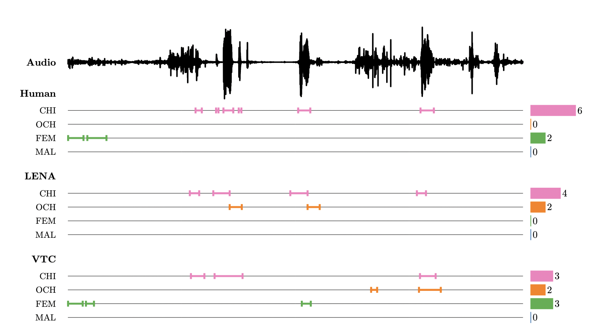

# Diarization Simulation

A Python package for simulating speaker diarization with LENA
and [VTC](https://github.com/MarvinLvn/voice-type-classifier) from ground truth vocalization data.

Diarization algorithms segment and classify speech into predefined speaker categories (including child (CHI) other
child (OCH), female adult (FEM), male adult (MAL)).
In Child Development and Language Acquisition research, these segments are aggregated into vocalization counts (see
below) measuring children's
speech output and their speech input in naturalistic daylong recordings.



However, algorithms make errors (e.g. by confusing speakers for one another) which propagate into the measured
vocalization counts, leading to biases in downstream analyses.
Simulating diarization algorithms can help assess the sensitivity of a statistical analysis to classification errors.
For instance, simulations can help determine whether correlations between speakers' speech quantities are entirely
consistent with spurious correlations due to classification errors.

## Overview

Diarization Simulation is a tool designed to simulate the distortion of vocalization counts from different speakers by
diarization
algorithms. It takes synthetic ground truth data as its input (the true speaker vocalization counts) and simulates
measured vocalization counts
based on the detection and confusion rates of LENA and VTC. The confusion rates of these algorithms were measured on
calibration data consisting of 30 hours of manual annotations.

## Installation

```bash
# Clone the repository
git clone https://github.com/LAAC-LSCP/diarization-simulation.git
cd diarization-simulation

# Install the package
pip install -e .
```

## Usage

The package can be used both programmatically (in Python scripts, notebooks, etc.) and via command-line interface.

### Command-line Interface

The package also provides a command-line tool `diarization-simulate`:

```bash
diarization-simulate --truth path/to/truth.csv \
                    --output path/to/output.csv \
                    --algo vtc \
                    --samples 1000 \
                    --distribution poisson
```

#### Command-line Arguments

| Argument                | Description                                                 | Default   |
|-------------------------|-------------------------------------------------------------|-----------|
| `--truth`               | Path to the synthetic truth dataset (in csv format)         | Required  |
| `--output`              | Location of the output file                                 | Required  |
| `--output-format`       | Output file format (`csv`, `parquet`, or `npz`)             | `csv`     |
| `--algo`                | Algorithm to simulate (`vtc` or `lena`)                     | Required  |
| `--samples`             | Number of samples per observation                           | 1000      |
| `--average-hyperpriors` | Use the mean value of the hyperpriors (mu and alpha)        | False     |
| `--unique-hyperpriors`  | Use fixed hyperpriors (mu and alpha) throughout all samples | False     |
| `--distribution`        | Distribution for vocalization counts (`poisson` or `gamma`) | `poisson` |
| `--seed`                | Random seed for reproducibility                             | None      |

### Input Format

The input CSV must contain the following columns:

- `observation`: Unique identifier for each recording/observation
- `CHI`: Child vocalization count
- `OCH`: Other child vocalization count
- `FEM`: Female adult vocalization count
- `MAL`: Male adult vocalization count

Example:

```csv
observation,CHI,OCH,FEM,MAL
1,120,30,200,50
2,90,15,180,70
3,150,25,220,45
```

### Output Format

The output will contain the following columns:

- `sample`: Sample number (0 to `n_samples-1`)
- `observation`: Original observation identifier
- `CHI`: Simulated child vocalization detection
- `OCH`: Simulated other child vocalization detection
- `FEM`: Simulated female adult vocalization detection
- `MAL`: Simulated male adult vocalization detection

Example output:

```csv
sample,observation,CHI,OCH,FEM,MAL
0,1,118,28,195,52
0,2,87,16,175,73
0,3,145,23,215,48
1,1,122,31,198,49
1,2,92,14,182,68
...
```

### Python API

#### Quick Start

```python
import pandas as pd
from diarization_simulation import simulate_diarization

# Create or load your truth data
truth_df = pd.DataFrame({
    'observation': [1, 2, 3],
    'CHI': [120, 90, 150],
    'OCH': [30, 15, 25],
    'FEM': [200, 180, 220],
    'MAL': [50, 70, 45]
})

# Simulate detections
results = simulate_diarization(
    truth_data=truth_df,
    algorithm="vtc",
    distribution="poisson",
    n_samples=1000,
    random_seed=42
)

print(f"Generated {len(results)} detection samples")
print(results.head())
```

#### Working with DataFrames

```python
# Load your data
truth_data = pd.read_csv("my_truth_data.csv")

# Quick simulation for analysis
results = simulate_diarization(
    truth_data=truth_data,
    algorithm="vtc",
    n_samples=100,
    hyperprior_mode="unique",  # Same hyperpriors for all samples
    verbose=False  # Disable progress bar
)

# Analyze results
mean_detections = results.groupby('observation')[['CHI', 'OCH', 'FEM', 'MAL']].mean()
print("Mean detections per observation:")
print(mean_detections)
```

#### API Parameters

**`simulate_diarization()` function parameters:**

| Parameter         | Type             | Description                                               | Default     |
|-------------------|------------------|-----------------------------------------------------------|-------------|
| `truth_data`      | str or DataFrame | Path to CSV file or pandas DataFrame with truth data      | Required    |
| `algorithm`       | str              | Algorithm to simulate (`"vtc"` or `"lena"`)               | `"vtc"`     |
| `distribution`    | str              | Distribution type (`"poisson"` or `"gamma"`)              | `"poisson"` |
| `n_samples`       | int              | Number of samples to generate per observation             | 1000        |
| `hyperprior_mode` | str              | Hyperprior handling (`"sample"`, `"average"`, `"unique"`) | `"sample"`  |
| `random_seed`     | int or None      | Random seed for reproducibility                           | None        |
| `verbose`         | bool             | Show progress bar                                         | True        |

**Hyperprior modes:**

- `"sample"`: Each sample gets its own hyperpriors (captures algorithm uncertainty)
- `"average"`: Use mean hyperprior values (reduced variance)
- `"unique"`: Same hyperpriors for all samples (minimal variance)

## Use Cases

The programmatic API is particularly useful for:

- **Interactive analysis** in Jupyter notebooks
- **Integration** into larger analysis pipelines
- **Parameter sweeps** and sensitivity analyses
- **Custom post-processing** of simulation results
- **Reproducible research** with version-controlled parameters

Example workflow:

```python
import pandas as pd
from diarization_simulation import simulate_diarization

# Load your ground truth data
truth_data = pd.read_csv("ground_truth.csv")

# Run simulations with different parameters
algorithms = ["vtc", "lena"]
distributions = ["poisson", "gamma"]
results = {}

for algo in algorithms:
    for dist in distributions:
        key = f"{algo}_{dist}"
        results[key] = simulate_diarization(
            truth_data=truth_data,
            algorithm=algo,
            distribution=dist,
            n_samples=1000,
            random_seed=42  # For reproducibility
        )

# Compare results
for key, result in results.items():
    correlation = result[['CHI', 'FEM']].corr().iloc[0, 1]
    print(f"{key}: CHI-FEM correlation = {correlation:.3f}")
```

## How It Works

The simulation works by:

1. Loading synthetic ground truth data (the "true" vocalization counts per speaker and per observation/recording)
2. Loading pre-computed hyperparameters characterizing the behavior of the chosen algorithm (VTC or LENA)
3. For each sample and observation, generating "measured" vocalization counts using a statistical model representing the
   algorithm's behavior.
4. Returning or saving the simulated detection results.

## Statistical Model

The simulation uses a hierarchical model where:

- `lambda_ij` ~ Gamma(alpha_ij, mu_ij/alpha_ij) represents detection rates
- Detected vocalizations are generated using one of two distribution options:
    - Poisson distribution: Detected ~ Poisson(lambda_ij * true_ij)
    - Gamma distribution: Detected ~ Int(Gamma(alpha, beta)) with mean lambda_ij * true_ij and standard deviation sqrt(
      lambda_ij * true_ij / tau)

Where:

- lambda_ij is the detection rate from speaker i to detected speaker j
- true_ij is the true vocalization count for speaker i
- tau is a precision parameter used in the gamma distribution option

The Poisson scheme slightly inflates the variance, and the gamma scheme attempts to capture the correct
variance but may be a poor approximation for small counts.

## Development

### Requirements

You will need Python 3.8+ to run this package. Key dependencies include:

- pandas
- numpy
- scipy
- numba
- tqdm

## Citation

XXX