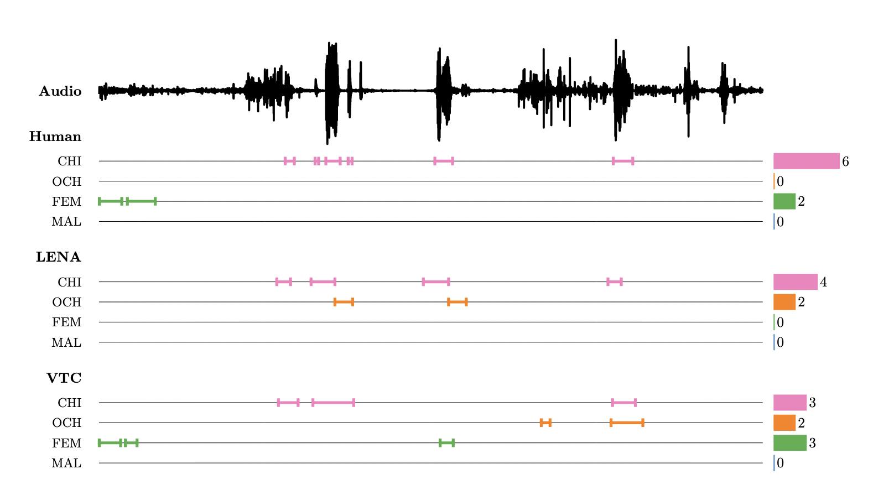

# Diarization Simulation

<!-- TOC -->

* [Overview](#overview)
* [Tutorial](#tutorial)
* [Installation](#installation)
  * [Requirements](#requirements)
* [Usage](#usage)
  * [Input Format](#input-format)
  * [Command-line Interface](#command-line-interface)
  * [Python API](#python-api)
  * [Output Format](#output-format)
  * [Generating Ground Truth from a ChildProject Corpus](#generating-ground-truth-from-a-childproject-corpus)
* [Statistical Model](#statistical-model)
  * [Parameters](#parameters)
  * [Model Characteristics](#model-characteristics)
* [Citation](#citation)


<!-- TOC -->

A Python package for simulating speaker diarization with LENA
and [VTC](https://github.com/MarvinLvn/voice-type-classifier) from ground truth vocalization data.

Diarization algorithms segment and classify speech into predefined speaker categories (including child (CHI) other
child (OCH), female adult (FEM), male adult (MAL)).
In Child Development and Language Acquisition research, these segments are aggregated into vocalization counts (see
below) measuring children's speech output and their speech input in naturalistic daylong recordings.



However, algorithms make errors (e.g. by mistaking speakers for one another) which propagate into the measured
vocalization counts, introducing biases in downstream analyses.
Simulating diarization algorithms can help assess the sensitivity of a statistical analysis to classification errors.
For instance, simulations can help determine whether correlations between speakers' speech quantities are entirely
consistent with spurious correlations due to classification errors.

## Overview

Diarization Simulation helps you assess how classification errors in automated diarization algorithms — LENA and VTC — affect downstream analyses of vocalization counts. You provide a ground truth dataset (true vocalization counts per speaker and per recording), and the tool simulates what those algorithms would *measure*, drawing on pre-computed detection and confusion rates calibrated against ~30 hours of manual annotations. Across many simulated samples, you can then ask: how sensitive is my finding to classification errors? Or: is an observed result consistent with errors alone?

Ground truth data can come from your own sources, or be generated synthetically. For users working with a [ChildProject](childproject.readthedocs.io) corpus, the package also includes an optional `truth-simulate` tool that infers realistic vocalization distributions from manual annotations and generates synthetic ground truth accordingly — see [Generating Ground Truth from a ChildProject Corpus](#generating-ground-truth-from-a-childproject-corpus).

Internally, the simulation loads your ground truth, applies algorithm-specific hyperparameters, and generates measured vocalization counts using a Poisson or Gamma approximation to account for underdispersion. See [Statistical Model](#statistical-model) for details.

For a concrete end-to-end example, see the [Tutorial](#tutorial).

## Tutorial

A step-by-step tutorial walks through a complete worked example using this package. It is available in two formats:

- **[tutorial.ipynb](tutorial.ipynb)** — Jupyter notebook using the Python API directly in an interactive mode
- **[tutorial.Rmd](tutorial.Rmd)** — R Markdown calling `diarization-simulate` via the command-line interface (through `system2()`)

Both follow the same structure and are aligned with Gautheron et al. (2025).

To help readers grasp the idea behind our proposal, we pick as our specific example whether an observed correlation between child vocalizations (CHI) and female adult vocalizations (FEM) — written R(CHI, FEM) — could be an artifact of diarization errors rather than a genuine relationship. This is a reasonable concern: if an algorithm systematically confuses CHI and FEM speech, recordings with many child vocalizations may also appear to have many female adult vocalizations, even if no true relationship exists.

The tutorial therefore poses the question: *is the observed correlation consistent with what we would expect under the null hypothesis that the true correlation is zero?* It does this by simulating what a diarization algorithm would measure if the ground truth had R(CHI, FEM) = 0, and checking whether the observed correlation falls within the range of simulated values.

This kind of sensitivity analysis is the primary use case for the package, and the tutorial is the fastest way to see the full workflow — from synthetic ground truth generation through to simulation and interpretation — end to end. For a 5-minute version, see the "Quick start" section at the top of the tutorial.

## Installation

```bash
# Clone the repository
git clone https://github.com/LAAC-LSCP/diarization-simulation.git
cd diarization-simulation

# Install the package
pip install -e .
```

### Requirements

You will need Python 3.8+ to run this package. Key dependencies include:

- pandas
- numpy
- scipy
- numba
- tqdm

If you followed the [Installation](#installation) instructions, you should have those packages already.

For users working with a [ChildProject](childproject.readthedocs.io) corpus, the package also includes an optional `truth-simulate` tool which requires installation of the following packages, which are not installed by default:

- cmdstanpy (see installation instructions [here](https://mc-stan.org/cmdstanpy/installation.html))
- ChildProject (see installation instructions [here](https://childproject.readthedocs.io/en/latest/install.html)

## Usage

The package can be used via the command-line interface or the Python API.

### Input Format

Both the CLI and Python API require the same columns in the input CSV:

- `observation`: Unique identifier for each recording/observation
- `CHI`: Child vocalization count
- `OCH`: Other child vocalization count
- `FEM`: Female adult vocalization count
- `MAL`: Male adult vocalization count

Example:

```csv
observation,CHI,OCH,FEM,MAL
1,120,30,200,50
2,90,15,180,70
3,150,25,220,45
```

### Command-line Interface

The main command line interface can be accessed through `diarization-simulate`:


```bash
diarization-simulate --truth path/to/truth.csv \
                    --output path/to/output.csv \
                    --algo vtc \
                    --samples 1000 \
                    --distribution poisson
```

#### Command-line Arguments

| Argument                | Description                                                 | Default   |
|-------------------------|-------------------------------------------------------------|-----------|
| `--truth`               | Path to the synthetic truth dataset (in csv format)         | Required  |
| `--output`              | Location of the output file                                 | Required  |
| `--output-format`       | Output file format (`csv`, `parquet`, or `npz`)             | `csv`     |
| `--algo`                | Algorithm to simulate (`vtc` or `lena`)                     | Required  |
| `--samples`             | Number of samples per observation                           | 1000      |
| `--average-hyperpriors` | Use the mean value of the hyperpriors (mu and alpha)        | False     |
| `--unique-hyperpriors`  | Use fixed hyperpriors (mu and alpha) throughout all samples | False     |
| `--distribution`        | Distribution for vocalization counts (`poisson` or `gamma`) | `poisson` |
| `--seed`                | Random seed for reproducibility                             | None      |

### Python API

```python
import pandas as pd
from diarization_simulation import simulate_diarization

# Load your ground truth data
truth_data = pd.read_csv("truth.csv")

# Simulate detections
results = simulate_diarization(
    truth_data=truth_data,
    algorithm="vtc",
    distribution="poisson",
    n_samples=1000,
    random_seed=42
)

# Analyze results
mean_detections = results.groupby('observation')[['CHI', 'OCH', 'FEM', 'MAL']].mean()
print("Mean detections per observation:")
print(mean_detections)
```

To compare results across algorithms and distribution types:

```python
# Run simulations with different parameters
algorithms = ["vtc", "lena"]
distributions = ["poisson", "gamma"]
results = {}

for algo in algorithms:
    for dist in distributions:
        key = f"{algo}_{dist}"
        results[key] = simulate_diarization(
            truth_data=truth_data,
            algorithm=algo,
            distribution=dist,
            n_samples=1000,
            random_seed=42
        )

# Compare R(CHI, FEM) across configurations
for key, result in results.items():
    correlation = result[['CHI', 'FEM']].corr().iloc[0, 1]
    print(f"{key}: CHI-FEM correlation = {correlation:.3f}")
```

#### Python API Arguments

| Parameter         | Type             | Description                                               | Default     |
|-------------------|------------------|-----------------------------------------------------------|-------------|
| `truth_data`      | str or DataFrame | Path to CSV file or pandas DataFrame with truth data      | Required    |
| `algorithm`       | str              | Algorithm to simulate (`"vtc"` or `"lena"`)               | `"vtc"`     |
| `distribution`    | str              | Distribution type (`"poisson"` or `"gamma"`)              | `"poisson"` |
| `n_samples`       | int              | Number of samples to generate per observation             | 1000        |
| `hyperprior_mode` | str              | Hyperprior handling (`"sample"`, `"average"`, `"unique"`) | `"sample"`  |
| `random_seed`     | int or None      | Random seed for reproducibility                           | None        |
| `verbose`         | bool             | Show progress bar                                         | True        |

**Hyperprior modes:**

- `"sample"`: Each sample gets its own hyperpriors (captures algorithm uncertainty)
- `"average"`: Use mean hyperprior values (reduced variance)
- `"unique"`: Same hyperpriors for all samples (minimal variance)

### Output Format

Both the CLI and Python API return the same structure:

- `sample`: Sample number (0 to `n_samples-1`)
- `observation`: Original observation identifier
- `CHI`, `OCH`, `FEM`, `MAL`: Simulated vocalization counts per speaker

Example:

```csv
sample,observation,CHI,OCH,FEM,MAL
0,1,118,28,195,52
0,2,87,16,175,73
1,1,122,31,198,49
1,2,92,14,182,68
```

### Generating Ground Truth from a ChildProject Corpus

If you have a [ChildProject](https://github.com/LAAC-LSCP/ChildProject) corpus with manual annotations, the package includes an optional `truth-simulate` tool that can generate synthetic ground truth by fitting a Bayesian hierarchical model to your annotation data, to infer a realistic speech distribution. This requires installing the optional dependencies listed in [Requirements](#requirements).

#### Command-line Interface for Ground Truth Generation

```bash
truth-simulate --corpus path/to/corpus \
               --annotator annotation_set_name \
               --output ground_truth.csv \
               --samples 1000
```

#### Command-line Arguments for `truth-simulate`

| Argument              | Description                                                                                   | Default  |
|-----------------------|-----------------------------------------------------------------------------------------------|----------|
| `--corpus`            | Path to the input ChildProject corpus                                                         | Required |
| `--annotator`         | Annotation set containing the manual annotations                                              | Required |
| `--output`            | Location of the output file                                                                   | Required |
| `--recordings`        | Path to a CSV file containing the list of recordings to include                               | None     |
| `--samples`           | Number of samples to generate                                                                 | 1000     |
| `--mode`              | Sample from the mode of the posterior distribution of hyperparameters                         | False    |
| `--show-distribution` | Show the marginal distribution of speech for each speaker according to the manual annotations | False    |

The output CSV contains synthetic ground truth with columns `recording_filename`, `observation`, `CHI`, `OCH`, `FEM`, and `MAL`, with K×N rows where K is the number of recordings and N the number of samples requested.

#### How Ground Truth Generation Works

The `truth-simulate` tool uses a Bayesian hierarchical model to infer vocalization rate distributions from sparse manual
annotations and then generates complete ground truth datasets. The process works as follows:

1. **Load corpus data**: Reads a ChildProject corpus containing recordings and manual annotations
2. **Extract annotation statistics**: Counts vocalizations per speaker type (CHI, OCH, FEM, MAL) in manually annotated
   segments
3. **Fit hierarchical model**: Uses Stan to fit a Gamma-Poisson model that estimates vocalization rates per speaker
   across the corpus
4. **Generate samples**: Produces synthetic ground truth vocalization counts for all recordings in the corpus

When using `truth-simulate`, the output CSV contains synthetic ground truth data with the same `CHI, OCH, FEM, MAL` columns as in [Output Format](#output-format), an additional `recording_filename` which contains the original recording filename, and `observation` being a unique identifier combining recording filename and sample number (e.g., "recording_001.wav,0").

Example output:

```csv
recording_filename,observation,CHI,OCH,FEM,MAL
recording_001.wav,"recording_001.wav,0",145,23,198,67
recording_002.wav,"recording_002.wav,0",112,18,176,45
recording_001.wav,"recording_001.wav,1",138,25,203,72
recording_002.wav,"recording_002.wav,1",119,16,181,49
...
```

As above, the output contains KxN rows where K is the number of recordings and N the number of samples requested.

#### Addapted Workflow 

When generating ground truth data using `truth-simulate`, a complete simulation workflow will:

1. **Generate ground truth** from your corpus annotations:

```bash
truth-simulate --corpus /path/to/corpus \
               --annotator human_annotations \
               --output ground_truth.csv \
               --samples 100
```

2. **Simulate diarization** on the generated ground truth:

```bash
diarization-simulate --truth ground_truth.csv \
                    --output simulated_detections.csv \
                    --algo vtc \
                    --samples 100
```

In this example, the output `simulated_detections.csv` will contain 100x100xK rows, where K is the number of recordings in the dataset.

## Statistical Model

The simulation uses a hierarchical model where:

- Detection/confusion rates $\lambda_{ij}$ follow: $\lambda_{ij} \sim \mathrm{Gamma}(\alpha_{ij}, \mu_{ij}/\alpha_{ij})$
- Detected vocalizations are generated using one of two distribution options:

1. The Poisson distribution:

```math
\mathrm{Detected}_{ij} \sim \mathrm{Poisson}(\lambda_{ij} \cdot \mathrm{true}_{i})
```

```math
\mathrm{Detected}_{j} = \sum_i \mathrm{Detected}_{ij}
```

2. The Gamma distribution:

```math
\mathrm{Detected}_{ij} \sim \lfloor\mathrm{Gamma}(\alpha, \beta)+0.5\rfloor
```

```math
\mathrm{Detected}_{j} = \sum_i \mathrm{Detected}_{ij}
```

With $\alpha$ and $\beta$ being fixed such that:

```math
\mathbb{E}[\mathrm{Detected}_{ij}] = \lambda_{ij} \cdot \mathrm{true}_{i} \text{ and } \sigma[\mathrm{Detected}_{ij}] = \sqrt{\frac{\lambda_{ij} \cdot \mathrm{true}_{i}}{\tau}}
```

### Parameters

| Parameter               | Description                                             |
|-------------------------|---------------------------------------------------------|
| $\lambda_{ij}$          | Detection rate from speaker $i$ to detected speaker $j$ |
| $\mathrm{true}_{i}$     | True vocalization count for speaker $i$                 |
| $\tau$                  | Underdispersion parameter                               |
| $\alpha_{ij}, \mu_{ij}$ | Shape and scale parameters for the detection rate prior |
| $\alpha, \beta$         | Shape and rate parameters for the gamma detection model |

### Model Characteristics

The original model assumed a Generalized Poisson Distribution, given that the vocalization counts are underdispersed wrt
the Poisson distribution.
However, sampling from this distribution is a bit harder, and the simulation proposes two approximation schemes instead:

- **Poisson scheme**: neglects the underdispersion of the count data
- **Gamma scheme**: better captures the true variance but only approximate for small count data

## Citation

If you use this package, please mention both of the following references:

```bib
@online{diarization-simulation,
author={Lucas Gautheron},
year=2025,
title={Diarization Simulation: A Python package for simulating speaker diarization with {LENA and VTC} from ground truth vocalization data},
url={https://github.com/LAAC-LSCP/diarization-simulation}
}

@misc{Gautheron2025,
  title = {Classification errors distort findings in automated speech processing: examples and solutions from child-development research},
  url = {http://dx.doi.org/10.31234/osf.io/u925y_v1},
  author = {Gautheron,  Lucas and Kidd,  Evan and Malko,  Anton and Lavechin,  Marvin and Cristia,  Alejandrina},
  year = {2025},
}
```
