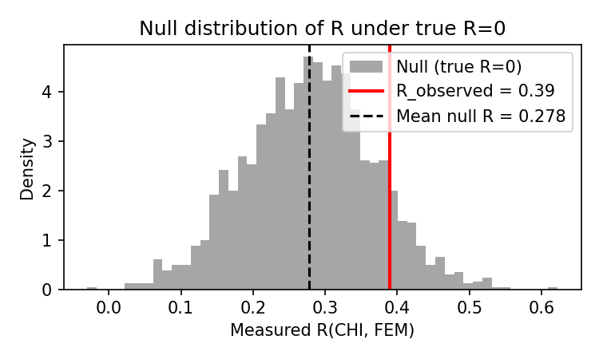

# Tutorial: Using the Diarization Simulation Package

This tutorial provides a **documented example of use** of the diarization-simulation package: from installation through a complete worked example with expected outputs and interpretation. It goes beyond the README by walking you through two concrete analyses using the correlation between child and female-adult vocalization counts, **R(CHI, FEM)**: (1) examining how sensitive this quantity is to confusion errors, and (2) testing whether an observed value of R could be explained by classification errors alone.

The package and methods are described in Gautheron et al. (2025), *Classification errors distort findings in automated speech processing: examples and solutions from child-development research*.

**Example outputs** and the null-distribution figure shown below are taken from running the companion [tutorial notebook](tutorial.ipynb); you can reproduce them by executing the notebook.

---

## Contents

1. [Quick start (5 minutes)](#quick-start-5-minutes)
2. [Why use this package?](#why-use-this-package)
3. [Installation and prerequisites](#installation-and-prerequisites)
4. [Complete worked example: R(CHI, FEM) — sensitivity and significance](#complete-worked-example-rchi-fem--sensitivity-and-significance)
5. [Step-by-step reference](#step-by-step-reference)
6. [Interpreting simulation results](#interpreting-simulation-results)
7. [Tips and troubleshooting](#tips-and-troubleshooting)
8. [References](#references)

---

## Quick start (5 minutes)

If you want to see the package in action immediately, run the following in a terminal from the project root (after installing with `pip install -e .`).

**1. Create a small ground truth file** (`truth.csv`):

```csv
observation,CHI,OCH,FEM,MAL
1,120,30,200,50
2,90,15,180,70
3,150,25,220,45
```

**2. Simulate VTC “measurements”** (100 samples, ~10–30 seconds):

```bash
diarization-simulate --truth truth.csv --output simulated.csv --algo vtc --samples 100 --distribution poisson --seed 42
```

**3. Inspect the output:**

```bash
head -20 simulated.csv
```

You should see columns `sample`, `observation`, `CHI`, `OCH`, `FEM`, `MAL`. Each `observation` appears 100 times (one per `sample`), with different simulated counts reflecting algorithm variability and confusion.

**4. Quick check in Python** (optional):

```python
import pandas as pd
sim = pd.read_csv("simulated.csv")
# Mean simulated counts per observation (should be in the ballpark of truth)
sim.groupby("observation")[["CHI", "OCH", "FEM", "MAL"]].mean()
```

You now have simulated “measured” vocalization counts that you can feed into your own analysis and compare to the known truth. The rest of this tutorial explains the workflow in detail and gives a full example with interpretation.

---

## Why use this package?

Automated diarization algorithms (LENA, VTC) segment and label speech into speaker types (CHI, OCH, FEM, MAL). Their errors—missed detections and confusions between speakers—propagate into vocalization counts and can **bias** downstream statistics (correlations, effect sizes, proportions).

**Simulations** let you:

1. Start from synthetic or real “true” vocalization counts.
2. Simulate what LENA or VTC would *measure* given those true counts (using calibration-based confusion rates from the manuscript).
3. Run your analysis on the simulated measurements and compare results to the known truth.

If simulated estimates systematically differ from the true values, your analysis is sensitive to classification bias; you may then consider Bayesian calibration or other corrections (see the manuscript).

---

## Installation and prerequisites

- **Python 3.8+**
- For **ground-truth generation from a corpus**: a [ChildProject](https://github.com/LAAC-LSCP/ChildProject)-formatted corpus with manual annotations, plus optional dependencies (see README).

From the project root:

```bash
git clone https://github.com/LAAC-LSCP/diarization-simulation.git
cd diarization-simulation
pip install -e .
```

To also use ground-truth generation from a ChildProject corpus:

```bash
pip install -e ".[truth]"
```

Verify installation:

```bash
diarization-simulate --help
```

You should see usage and options for `--truth`, `--output`, `--algo`, `--samples`, etc.

---

## Complete worked example: R(CHI, FEM) — sensitivity and significance

We use the **correlation between child and female-adult vocalization counts**, R(CHI, FEM), as the quantity of interest. This correlation is central in language-acquisition research (e.g. input–output associations). The example has two parts:

1. **Step 1 — Sensitivity:** How much does the *measured* R(CHI, FEM) differ from the *true* R when we simulate algorithm output? This shows that the quantity is sensitive to confusion errors (bias and spurious correlation).
2. **Step 2 — Significance test:** You have a small corpus and observe a value of R from your algorithm. Could that value be due to classification errors alone (true R = 0)? We simulate under the null and test whether the observed R is consistent with confusion-only.

---

### Step 1: Examine the sensitivity of R(CHI, FEM) to confusion errors

We generate ground truth with a **known true correlation** between CHI and FEM across observations, simulate what VTC would report, then compute the **measured** R(CHI, FEM) from the simulated counts. By comparing measured R to true R, we see how much confusion errors distort this quantity.

#### 1.1 Generate ground truth from a multivariate log-normal

We draw vocalization counts from a **multivariate log-normal** distribution: log(counts) ∼ MVN(μ, Σ), with Σ given by per-speaker standard deviations and a correlation matrix. This is a natural model for positive, right-skewed counts with controlled correlations between speakers.

We create two small datasets: one with **CHI and FEM uncorrelated** (true R ≈ 0) and one with **positive CHI–FEM correlation** (true R ≈ 0.3). Each has 64 observations so we can later mimic a “small corpus.”

**Parameters:**
- **mean_log**: mean of log(counts) for each speaker [CHI, OCH, FEM, MAL] — controls typical counts.
- **std_log**: standard deviation of log(counts) for each speaker — controls spread.
- **corr_matrix**: 4×4 correlation matrix (symmetric, ones on diagonal) — controls correlations between speakers on the log scale.

```python
import numpy as np
import pandas as pd

SPEAKERS = ["CHI", "OCH", "FEM", "MAL"]

def make_ground_truth(n_obs, mean_log, std_log, corr_matrix, seed=42):
    """
    Generate ground truth vocalization counts: Z ~ MVN(mean_log, Sigma), then
    counts = Poisson(exp(Z)) (so rates are log-normal, counts are conditionally Poisson).

    Parameters
    ----------
    n_obs : int
        Number of observations (recordings).
    mean_log : array-like of length 4
        Mean of log(counts) for [CHI, OCH, FEM, MAL].
    std_log : array-like of length 4
        Standard deviation of log(counts) for each speaker.
    corr_matrix : 2D array, shape (4, 4)
        Correlation matrix for the Gaussian on the log scale (symmetric, ones on diagonal).
    seed : int
        Random seed.

    Returns
    -------
    pd.DataFrame with columns observation, CHI, OCH, FEM, MAL.
    """
    np.random.seed(seed)
    mean_log = np.asarray(mean_log, dtype=float)
    std_log = np.asarray(std_log, dtype=float)
    corr_matrix = np.asarray(corr_matrix, dtype=float)
    # Covariance: Sigma[i,j] = std_log[i] * std_log[j] * corr_matrix[i,j]
    D = np.diag(std_log)
    cov_log = D @ corr_matrix @ D
    Z = np.random.multivariate_normal(mean_log, cov_log, size=n_obs)
    rates = np.exp(Z)
    counts = np.random.poisson(rates).clip(min=0).astype(int)
    df = pd.DataFrame(counts, columns=SPEAKERS)
    df.insert(0, "observation", np.arange(1, n_obs + 1))
    return df

# Typical counts (geometric means): CHI ~1000, OCH ~300, FEM ~2000, MAL ~500
mean_log = np.log([1000, 300, 2000, 500])
std_log = np.array([0.4, 0.5, 0.35, 0.5])  # spread on log scale

# Correlation matrix: order [CHI, OCH, FEM, MAL]. Index 0=CHI, 2=FEM.
# True R = 0: CHI and FEM uncorrelated
corr_r0 = np.eye(4)
corr_r0[0, 2] = corr_r0[2, 0] = 0.0

# True R ≈ 0.3: positive CHI–FEM correlation on log scale
corr_r03 = np.eye(4)
corr_r03[0, 2] = corr_r03[2, 0] = 0.35  # log-scale correlation (count R will be similar)

n_obs = 64
truth_r0 = make_ground_truth(n_obs, mean_log, std_log, corr_r0)
truth_r03 = make_ground_truth(n_obs, mean_log, std_log, corr_r03)

# True R(CHI, FEM) from the generated counts (Pearson correlation)
print("True R(CHI,FEM) when CHI–FEM uncorrelated:", truth_r0[["CHI", "FEM"]].corr().iloc[0, 1])
print("True R(CHI,FEM) when CHI–FEM correlated:  ", truth_r03[["CHI", "FEM"]].corr().iloc[0, 1])
truth_r0.to_csv("example_truth_r0.csv", index=False)
truth_r03.to_csv("example_truth_r03.csv", index=False)
```

**Example output** (from the notebook):

```
True R(CHI,FEM) when CHI–FEM uncorrelated: 0.017
True R(CHI,FEM) when CHI–FEM correlated:   0.307
```

**What you have:** Two CSV files with 64 observations each. In `example_truth_r0.csv` the true correlation between CHI and FEM is ≈ 0; in `example_truth_r03.csv` it is ≈ 0.3 (or similar, depending on the log-scale correlation you set).

#### 1.2 Simulate VTC output and compute measured R per sample

For each ground truth we simulate many “measured” datasets (e.g. 500 samples). For each sample we compute the Pearson correlation between CHI and FEM **across observations** — that is the measured R(CHI, FEM) for that sample.

```python
from diarization_simulation import simulate_diarization

n_samples = 500
# Simulate under true R = 0
sim_r0 = simulate_diarization(
    truth_data="example_truth_r0.csv",
    algorithm="vtc",
    distribution="poisson",
    n_samples=n_samples,
    random_seed=42,
    verbose=True,
)
# Simulate under true R = 0.3
sim_r03 = simulate_diarization(
    truth_data="example_truth_r03.csv",
    algorithm="vtc",
    distribution="poisson",
    n_samples=n_samples,
    random_seed=43,
    verbose=True,
)

def measured_r_per_sample(sim_df):
    """For each sample, compute R(CHI, FEM) across observations."""
    r_list = []
    for s in sim_df["sample"].unique():
        sub = sim_df[sim_df["sample"] == s]
        r = sub[["CHI", "FEM"]].corr().iloc[0, 1]
        r_list.append(r)
    return np.array(r_list)

R_measured_r0 = measured_r_per_sample(sim_r0)
R_measured_r03 = measured_r_per_sample(sim_r03)
```

#### 1.3 Compare measured R to true R (sensitivity)

```python
print("When TRUE R(CHI,FEM) = 0:")
print("  Mean measured R:", R_measured_r0.mean())
print("  Std measured R: ", R_measured_r0.std())
print("  (Spurious correlation from confusion alone)")

print("When TRUE R(CHI,FEM) ≈ 0.3:")
print("  Mean measured R:", R_measured_r03.mean())
print("  Std measured R: ", R_measured_r03.std())
print("  (Bias: measured R vs true 0.3)")
```

**Example output** (from the notebook):

```
When TRUE R(CHI,FEM) = 0:
  Mean measured R: 0.233
  Std measured R:  0.091
  (Spurious correlation from confusion alone)

When TRUE R(CHI,FEM) ≈ 0.3:
  Mean measured R: 0.457
  Std measured R:  0.077
  (Bias: measured R vs true 0.3)
```

**Interpretation:** Even when the true correlation is **zero**, the measured R is typically **positive** (spurious correlation induced by confusion, e.g. CHI and FEM both benefiting from shared misclassifications). When the true R is 0.3, the measured R is often **inflated** relative to 0.3. So R(CHI, FEM) is **sensitive** to confusion errors: both bias and extra variance. The manuscript reports similar patterns (e.g. Section 3.1, Figure “clips”).

---

### Step 2: Test whether an observed R is consistent with classification errors alone

**Scenario:** You have a **small corpus** (e.g. 64 recordings). You ran VTC and computed R(CHI, FEM) across recordings; you observe **R_observed = 0.39**. You want to know: could this value arise **only** from classification errors, with the true correlation being zero? If not, you have some evidence that a real association exists (or other confounds), not just algorithm artifact.

**Idea:** Under the **null** that the true R = 0, we simulate many VTC “measurements” and obtain the **null distribution** of measured R. We then compare R_observed to this distribution (e.g. one-tailed or two-tailed p-value).

#### 2.1 Assume your corpus size and observed R

```python
n_obs_corpus = 64
R_observed = 0.39
```

#### 2.2 Generate null ground truth (true R = 0) with the same number of observations

Use the same number of observations as your corpus and the same multivariate log-normal setup with **CHI–FEM correlation = 0** (uncorrelated on the log scale).

```python
# Reuse mean_log, std_log, and corr_r0 from Step 1 (or redefine them)
truth_null = make_ground_truth(n_obs_corpus, mean_log, std_log, corr_r0, seed=123)
truth_null.to_csv("example_truth_null.csv", index=False)
```

#### 2.3 Simulate many VTC outputs under the null and get the null distribution of R

```python
n_null_samples = 2000
sim_null = simulate_diarization(
    truth_data="example_truth_null.csv",
    algorithm="vtc",
    distribution="poisson",
    n_samples=n_null_samples,
    random_seed=999,
    verbose=True,
)
R_null = measured_r_per_sample(sim_null)
```

#### 2.4 Compare R_observed to the null distribution and compute a p-value

We ask: how often would we see a measured R **at least as large** as R_observed if the true R were zero? (One-tailed: positive association. For a two-tailed test, use the proportion of |R_null| ≥ |R_observed|.)

```python
# One-tailed p-value: proportion of null R >= R_observed
p_one_tailed = (R_null >= R_observed).mean()
# Two-tailed: proportion of |R_null| >= |R_observed|
p_two_tailed = (np.abs(R_null) >= np.abs(R_observed)).mean()

print("R_observed =", R_observed)
print("Null distribution: mean =", R_null.mean(), ", std =", R_null.std())
print("One-tailed p-value (H0: true R <= 0):", p_one_tailed)
print("Two-tailed p-value (H0: true R = 0):", p_two_tailed)
```

**Example output** (from the notebook):

```
R_observed = 0.39
Null distribution: mean = 0.272 , std = 0.099
One-tailed p-value (H0: true R <= 0): 0.1175
Two-tailed p-value (H0: true R = 0): 0.1175
```

**Interpretation:** If the p-value is **small** (e.g. < 0.05), the observed R is **not easily explained** by classification errors alone: values as large as R_observed are rare when the true R is zero. You might conclude that the correlation is “significant” in the sense that it is unlikely to be due only to confusion. If the p-value is **large**, the observed R is **consistent** with the null (true R = 0); the apparent correlation could be spurious from algorithm errors, and you should not claim evidence for a real association based on this statistic alone. The manuscript discusses testing whether observed correlations are consistent with classification errors (e.g. Section 3.1).

#### 2.5 Optional: plot null distribution and R_observed

```python
import matplotlib.pyplot as plt

fig, ax = plt.subplots(1, 1, figsize=(5, 3))
ax.hist(R_null, bins=50, density=True, alpha=0.7, color="gray", label="Null (true R=0)")
ax.axvline(R_observed, color="red", lw=2, label=f"R_observed = {R_observed}")
ax.axvline(R_null.mean(), color="black", ls="--", label=f"Mean null R = {R_null.mean():.3f}")
ax.set_xlabel("Measured R(CHI, FEM)")
ax.set_ylabel("Density")
ax.legend()
ax.set_title("Null distribution of R under true R=0")
plt.tight_layout()
plt.savefig("example_null_R_chi_fem.png", dpi=150)
plt.show()
```

**What you will see:** A histogram of measured R when the true R is zero (often centered above 0 due to spurious correlation). Your R_observed is marked; if it falls in the right tail, the one-tailed p-value is small. Example figure (generated by the notebook):

 (often centered above 0 due to spurious correlation). Your R_observed is marked; if it falls in the right tail, the one-tailed p-value is small.

---

### Summary of the two steps

| Step | Goal | What you do |
|------|------|-------------|
| **1. Sensitivity** | See how much R(CHI, FEM) is distorted by confusion | Generate ground truth with known true R (e.g. 0 and 0.3), simulate algorithm, compute measured R per sample; compare mean(measured R) to true R. |
| **2. Significance** | Test if an observed R could be due to errors alone | Take your corpus size and R_observed; simulate under null (true R=0), get null distribution of measured R; compute p-value = proportion of null R ≥ R_observed (or two-tailed). |

You can reuse the same logic for other quantities (e.g. other correlations, proportion female, effect of siblings): (1) simulate with known true values to assess sensitivity, and (2) simulate under a null to test whether an observed value is consistent with classification errors alone.

---

## Step-by-step reference

### Ground truth format

You need a table with one row per observation and columns:

- `observation`: unique identifier (e.g. recording id or `"filename,0"`)
- `CHI`, `OCH`, `FEM`, `MAL`: non-negative integer vocalization counts

Example CSV:

```csv
observation,CHI,OCH,FEM,MAL
1,120,30,200,50
2,90,15,180,70
```

You can create this in Python, export from a spreadsheet, or generate it from a ChildProject corpus with `truth-simulate` (see README).

### Running the simulation

**Command line:**

```bash
diarization-simulate --truth <path-to-truth.csv> \
                     --output <path-to-output.csv> \
                     --algo vtc \
                     --samples 1000 \
                     --distribution poisson \
                     --seed 42
```

- `--algo`: `vtc` or `lena`
- `--samples`: number of simulated “datasets” per observation (e.g. 500–2000 for stable statistics)
- `--distribution`: `poisson` or `gamma` (see README for the model)
- `--seed`: for reproducibility
- Optional: `--average-hyperpriors`, `--unique-hyperpriors`, `--output-format parquet` or `npz`

**Python API:**

```python
from diarization_simulation import simulate_diarization

results = simulate_diarization(
    truth_data="truth.csv",   # or a pandas DataFrame
    algorithm="vtc",
    distribution="poisson",
    n_samples=1000,
    random_seed=42,
    verbose=True,
    hyperprior_mode="sample",  # "sample" | "average" | "unique"
)
# results: DataFrame with columns sample, observation, CHI, OCH, FEM, MAL
```

### Using simulated data in your analysis

1. Load the simulated CSV (and ground truth if needed).
2. For each `sample` (0 to n_samples−1), run the **same** analysis you would run on real algorithm output (e.g. regression, proportion female, effect of siblings on input).
3. Collect the estimated parameters or statistics across samples.
4. Compare their distribution to the **true** values (from your ground truth or known by design). Systematic difference → bias; spread → uncertainty induced by algorithm behavior.

---

## Interpreting simulation results

- **Sensitivity (Step 1):** If the *mean* measured statistic (e.g. R(CHI, FEM)) differs from the true value you set in ground truth, the quantity is biased by confusion. The *spread* of the measured statistic across samples reflects extra uncertainty from algorithm behavior. Use this to see how much a given quantity is distorted by classification errors.
- **Significance (Step 2):** Under a null (e.g. true R = 0), the distribution of the measured statistic is the “null distribution.” If your observed value falls in the tail of this distribution (small p-value), it is not easily explained by classification errors alone; if it falls in the bulk (large p-value), it is consistent with the null (e.g. spurious correlation from confusion).
- **Bias and variance:** Systematic difference from the true value is bias; spread across samples is variance. Both matter when judging sensitivity and when building null distributions.
- **Algorithm comparison:** Run the same ground truth through both `vtc` and `lena` and compare bias and null distributions. Different algorithms can yield different biases and different variances (e.g. LENA often more variable in the manuscript).
- **Next steps:** If bias is large or your observed statistic is not significant against the null, consider Bayesian calibration (manuscript) or reporting uncertainty; simulations **diagnose** sensitivity and test consistency with classification errors alone.

---

## Tips and troubleshooting

- **Reproducibility:** Always set `--seed` (CLI) or `random_seed` (Python) when you need repeatable results.
- **Sample size:** Use at least a few hundred `--samples` for stable means and SDs of your statistics; 1000+ is safer for publication.
- **Hyperpriors:** `hyperprior_mode="sample"` (default) reflects full algorithm uncertainty; `"average"` or `"unique"` reduces variance and run time.
- **Column names:** Must be exactly `observation`, `CHI`, `OCH`, `FEM`, `MAL`; counts must be non-negative integers.
- **Missing optional columns:** If you use a DataFrame without `observation`, the code uses the row index; for CSV, include an `observation` column.
- **Large runs:** For many observations and many samples, simulation can be slow; start with smaller `n_samples` (e.g. 100–200) to test your pipeline, then increase.

---

## References

- **Package:** [LAAC-LSCP/diarization-simulation](https://github.com/LAAC-LSCP/diarization-simulation)
- **Manuscript:** Gautheron, L., Kidd, E., Malko, A., Lavechin, M., & Cristia, A. (2025). *Classification errors distort findings in automated speech processing: examples and solutions from child-development research.* [DOI: 10.31234/osf.io/u925y](http://dx.doi.org/10.31234/osf.io/u925y)

For installation options, ground-truth generation from a ChildProject corpus, and the statistical model, see the project **README.md**.
